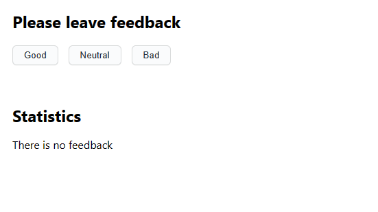
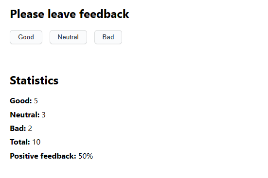

# SimpleFeedback app

This is a React app built using
[Create React App](https://github.com/facebook/create-react-app) as a part of
GoIT course. It allows you to collect and display feedback from users.

## Features

This app gives you three options as to what feedback you'd like to leave:

- Good
- Neutral
- Bad



Once at least one answer has been given, the following data will be displayed
below:

- Total amount of answers
- Percentage of "good" feedback compared to total



**PLEASE NOTE THAT AT THIS POINT YOU ARE NOT ABLE TO SAVE COLLECTED DATA BETWEEN
SESSIONS**

## Usage

1. Clone this repository.
2. Install the project's base dependencies using command

```shell
npm install
```

3. Start development mode by running command

```shell
npm start
```

4. Go to [http://localhost:3000](http://localhost:3000) in your browser. This
   page will automatically reload after saving changes to the project files.

## Deployment

Having cloned the repository, navigate to `Settings` > `Actions` > `General` as
shown below.


Find the `«Workflow permissions»` section, choose `«Read and write permissions»`
and click on the checkbox below. This will allow deployment process to be
automated.


The production version of the project will automatically be linted, built, and
deployed to GitHub Pages, in the `gh-pages` branch, every time the `main` branch
is updated. For example, after a direct push or an accepted pull request. To do
this, you need to edit the `homepage` field in the `package.json` file,
replacing `your_username` and `your_repo_name` with your own, and submit the
changes to GitHub.

```json
"homepage": "https://your_username.github.io/your_repo_name/"
```

Now the only thing left to do is to build and deploy from the `/root` folder of
the `gh-pages` branch, if this was not done automatically.
